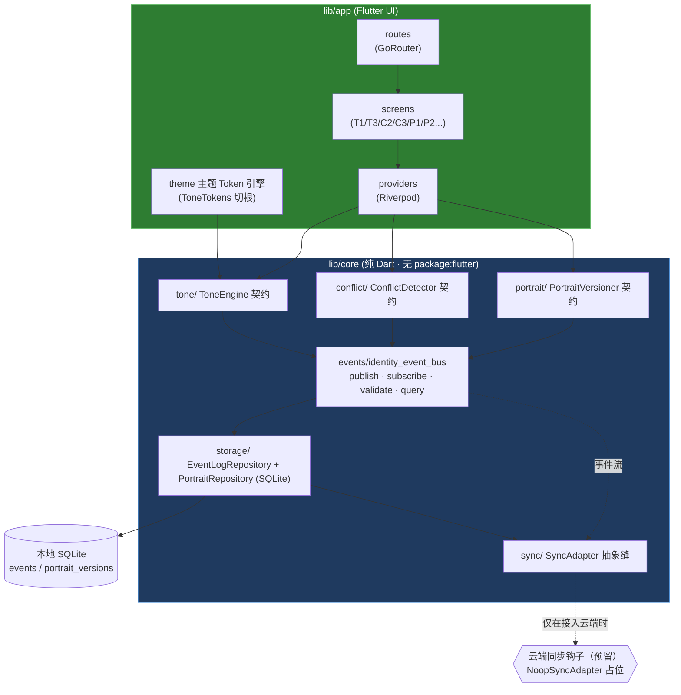
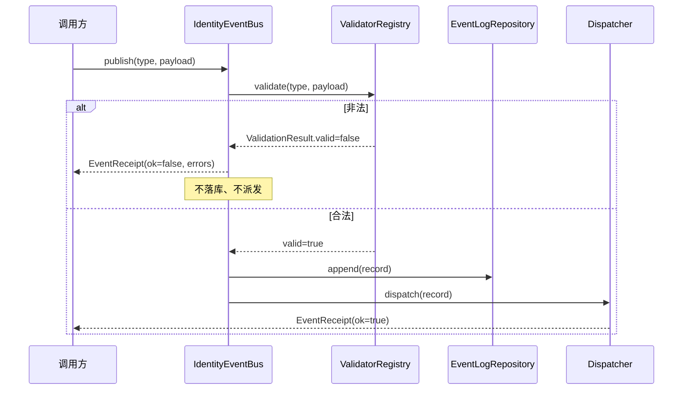
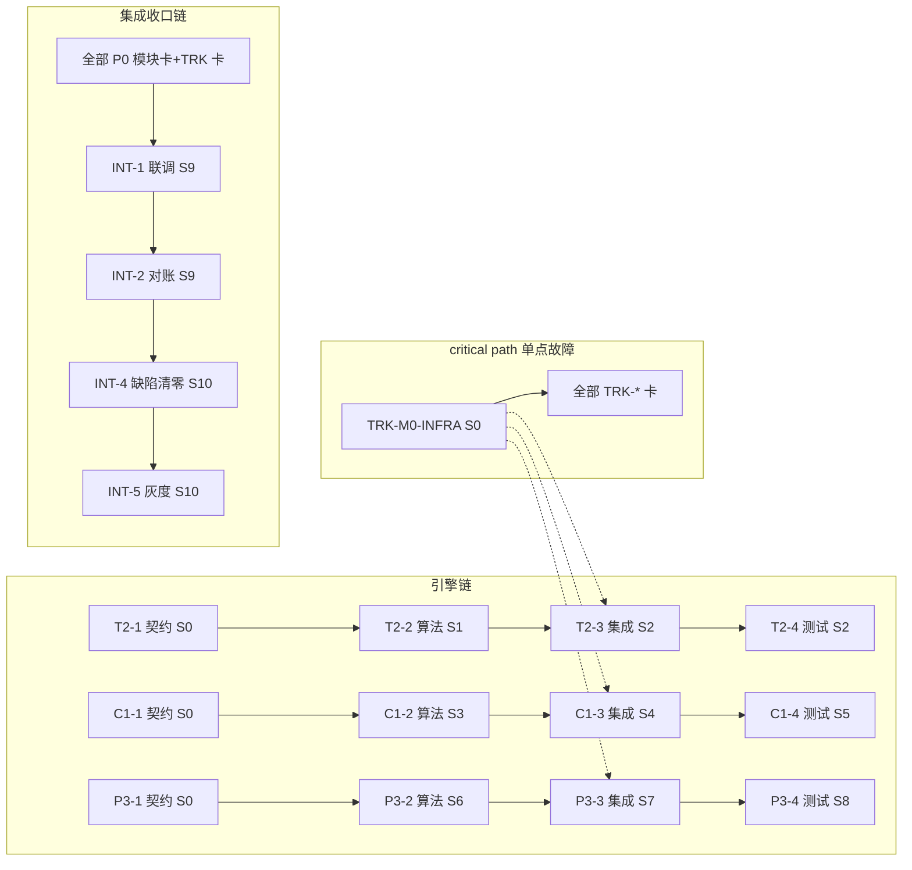

# PrimeAtlas 架构设计文档（Phase1 · 三大硬缺口补完）

> **文档元信息**
> | 项 | 内容 |
> |----|------|
> | 标题 | PrimeAtlas 架构设计（Flutter 单代码库 · 本地优先） |
> | 日期 | 2026-07-17 |
> | 基于 | `docs/handoff/handoff-dev-phase1-s0-2026-07-17.md`、PRD `prd-blueprint-gaps-2026-07-17.md`、44 张任务卡 `task-cards-phase1-gaps-2026-07-17.md`、完整需求蓝图 `PrimeAtlas_完整需求蓝图_Final.md`、`README.md` |
> | 状态 | S0 地基阶段 · 已对齐 M0 冻结决策（胜总拍板） |
> | 一句话目的 | 定义 PrimeAtlas 在 **Flutter 单 Dart 代码库 + 本地优先** 形态下的分层结构、契约与模块边界，作为后续 S0–S10 全部开发卡的实现基准 |
>
> **重要对齐说明（覆盖 handoff §6）**：交接包 §6 *推荐* Node/TS/Fastify + vanilla HTML 技术栈，已被产品负责人（胜总）M0 冻结决策 **显式推翻**。本架构采用 **原生 Android/iOS + Flutter 单代码库**，混合启动（hybrid start）= 本地优先 + 云端同步预留。因此：**没有服务器、没有 Fastify**；"后端"即纯 Dart 核心层 `lib/core`，它**不导入任何 `package:flutter` UI 类型**，仅依赖 `dart:` 与纯 Dart 包，可在无 Flutter Context 下被单测。交接包中的 TS 接口契约在本架构中翻译为 **Dart sealed class / 接口**，字段名与语义保持 1:1（便于需求追溯）。

---

## 1. 总体架构（Overview）

PrimeAtlas 是「个人成长操作系统」，定位「陪你成为」，刻意脱离健身 App 归类。Phase1 补完三大硬性缺失：**调性系统（Tone）**、**冲突检测（Conflict）**、**画像动态更新（Portrait）**。

架构采用 **Flutter 单代码库 + 本地优先（local-first）**，分两层：

- **`lib/core`（纯 Dart 核心层）**：事件总线、三引擎契约与算法、SQLite 持久化、同步适配缝（SyncAdapter）。不依赖 `package:flutter`，可独立单测。
- **`lib/app`（Flutter UI 层）**：主题 Token 引擎（消费 `lib/core/tone` 状态切根）、Riverpod 状态管理、GoRouter 路由、各业务页面。



**关键设计约束**

| 维度 | 决策 |
|------|------|
| 状态管理 | Riverpod（Provider/Notifier/AsyncNotifier） |
| 路由 | GoRouter（声明式，按身份阶段/红线场景组织路由） |
| 持久化 | 本地 SQLite（`sqflite`/`sqlite3`，纯 Dart 绑定层） |
| 同步 | `SyncAdapter` 抽象缝 + `NoopSyncAdapter`（云端钩子预留，Phase1 不实现） |
| 后端 | 无服务器；`lib/core` 即"后端逻辑" |
| 主题 | 单一 Token 真源（`ToneTokens`），4 调性 × 语义变量，杜绝多套 UI 换皮 |

---

## 2. 目录结构（Directory layout）

目录严格对齐 `README.md` 声明的 `lib/core`、`lib/app`、`test/` 结构。

```
lib/
  core/                         # 纯 Dart · 禁止 import 'package:flutter'
    events/
      identity_event_bus.dart   # IdentityEventBus 抽象 + 内存/SQLite 组合实现
      event_receipt.dart        # EventReceipt / ValidationResult / QuerySpec / EventRecord
      event_payload.dart        # EventPayload 基类（toJson/fromJson 契约）
      validator.dart            # Validator 接口 + 注册表
      schemas/                  # 7 个事件 schema（见 §5）
        tone_change_event.dart
        content_tone_tag.dart
        conflict_detected.dart
        arbitration_event.dart
        profile_field_update.dart
        identity_transition_event.dart
        dimension_data_presence.dart
    tone/
      tone_types.dart           # Tone / IdentityStage / ToneState / ToneSwitchRequest·Response / HealthBandwidthConfig
      tone_engine.dart          # ToneEngine 抽象契约（switchTone / getHealthBandwidth）
      tone_state_machine.dart   # 4 阶段 × 调性合法状态空间 + 健康带宽判定
    conflict/
      conflict_types.dart       # ConflictType / ConflictDetectionResult / Disposition / Orchestration
      conflict_engine.dart      # ConflictDetector 抽象契约（detect）
    portrait/
      portrait_types.dart       # PortraitVersion / VersionDiff / ProfileSnapshot / FieldChange
      portrait_engine.dart      # PortraitVersioner 抽象契约（createVersion/diff/rollback/getDimensionStatus）
    storage/
      event_log_repository.dart # EventLogRepository 抽象（append / query）
      portrait_repository.dart  # PortraitRepository 抽象（save / get / list）
      sqlite/
        sqlite_event_log.dart   # SQLite 实现（import 纯 Dart sqlite 包）
        sqlite_portrait.dart
        schema.sql              # DDL：events / portrait_versions
    sync/
      sync_adapter.dart         # SyncAdapter 抽象 + NoopSyncAdapter（云端钩子预留）
  app/                          # Flutter UI
    theme/
      tone_tokens.dart          # ToneTokens（ThemeExtension），4 调性语义变量真源
      tone_theme.dart           # 由 ToneState 生成 ThemeData
    providers/
      tone_provider.dart        # Riverpod：暴露当前 ToneState，驱动主题切根
      conflict_provider.dart
      portrait_provider.dart
    routes/
      app_router.dart           # GoRouter 路由表
    screens/
      tone/   (tone_center, content_review, ...)
      conflict/ (arbitration, conflict_card, safety_channel, ...)
      portrait/ (field_manager, narrative, dimension_manager, ...)
      settings/ (default_tone, ...)
test/                          # 镜像 lib/core
  core/
    events/   (bus_publish_subscribe, validator_reject, query)
    tone/     (state_machine, health_bandwidth)
    conflict/ (detection, blocked_user_invariant)
    portrait/ (versioning, dimension_invariant)
    storage/  (sqlite_event_log, sqlite_portrait)
    sync/     (noop_sync_adapter)
```

> **约定（重要）**：为 1:1 保障与 handoff TS 契约的字段可追溯性，`lib/core` 内所有数据类的字段名采用 **snake_case**（与 TS 契约逐字一致），通过 `toJson()` 序列化时不改名，因此契约字段零歧义。这是刻意偏离 Dart camelCase 惯用法、以需求追溯为优先的架构决策。

---

## 3. identity_event_bus 设计

事件总线是全部埋点卡（12 张 TRK-*）与三模块红线验收的**数据前置与单点故障**（S0 必须最先落地）。它承担原 handoff "看板查询 API" 的职责，但在本地优先形态下化为**对持久化事件日志的本地查询层**。

### 3.1 对外 API

```dart
/// 事件总线抽象（lib/core/events/identity_event_bus.dart）
abstract class IdentityEventBus {
  /// 发布事件：先 validate，非法 payload 直接拒绝（100% 拒绝率，不落库、不派发）。
  /// 合法则落 SQLite 事件日志并同步派发给内存订阅者，返回回执。
  EventReceipt publish(String eventType, EventPayload payload);

  /// 订阅某事件类型；返回取消函数（unsubscribe）。
  void Function() subscribe(String eventType, EventHandler handler);

  /// 仅校验（不落库、不派发），供 UI 预览 / 集成测试使用。
  ValidationResult validate(String eventType, EventPayload payload);

  /// 本地查询层：替代 handoff "看板查询 API"，按事件类型 / 时间维度检索。
  List<EventRecord> query(QuerySpec spec);
}

typedef EventHandler = void Function(EventRecord record);

class EventReceipt {
  final String receiptId;
  final String eventType;
  final int storedAt;          // epoch ms
  final bool ok;               // false = 被校验拒绝
  final List<String>? errors;  // 拒绝原因
}

class ValidationResult {
  final bool valid;
  final List<String> errors;
  const ValidationResult(this.valid, [this.errors = const []]);
}

class QuerySpec {
  final List<String> eventTypes;   // 空 = 全部
  final int? from;                 // epoch ms 下界
  final int? to;                   // epoch ms 上界
  final int? limit;
  final String? sessionId;
  const QuerySpec({this.eventTypes = const [], this.from, this.to, this.limit, this.sessionId});
}

class EventRecord {
  final String id;
  final String eventType;
  final Map<String, Object?> payload; // 已反序列化
  final int createdAt;
  final String? sessionId;
}
```

### 3.2 实现策略（组合模式）

|S0 交付物|实现|说明|
|---------|------|----|
| 内存派发 | `_InMemoryDispatcher` | `Map<String, Set<EventHandler>>`；`publish` 落库后遍历派发。|
| 持久化 | `SqliteEventLogRepository`（实现 `EventLogRepository`） | `publish` 调用 `append()` 写 `events` 表；`query()` 走 `SELECT ... WHERE event_type IN (...) AND created_at BETWEEN ...`。|
| 校验注册表 | `ValidatorRegistry` | `eventType -> Validator`；未知类型或校验失败 → `ValidationResult.valid=false`。|

**发布流程（保证 100% 拒绝）**



### 3.3 看板底座（本地查询）

看板底座即 `query(QuerySpec)` 之上的一层**聚合函数**（在 `lib/core/events/` 内，纯 Dart）：

- `redlineCoverage()`：按事件类型统计计数，支撑 T-RL / C-RL / P-RL 看板。
- `timeSeries(type, bucket)`：按时间分桶，支撑切换频率 / 冲突检出率趋势。
- 防虚荣指标（TRK-V1/V2/V3）消费事件流计算（见 §9 映射）。

---

## 4. 事件 Schema（7 schemas）

> **关于"6 还是 7"的口径澄清**：handoff §5.1 标题与验收写为"6 事件 schema"，但同节表格实际列出 7 个（含 `dimension_data_presence`，对应 P-RL1）。本架构以**完整 7 个**为准，S0 一次性交付全部 7 个 schema + 校验器（S0 验收门中的 "6/7" 即指这第 7 个 `dimension_data_presence` 一并纳入）。字段类型与必填严格遵循 handoff §5.1 表格。

每个 schema 实现 `EventPayload`，并配套一个 `Validator` 做**字段类型 + 必填**检查（非法 100% 拒绝）。

### 4.1 ToneChangeEvent（`tone_change_event`）
```dart
class ToneChangeEvent implements EventPayload {
  static const String eventType = 'tone_change_event';
  final Tone fromTone;
  final Tone toTone;
  final ToneSwitchTrigger trigger; // user_explicit|system_suggested|context_adaptive
  final bool blockedBySystem;
  final String? unlockPath;        // 渐进解锁路径，可空
  const ToneChangeEvent({required this.fromTone, required this.toTone,
      required this.trigger, required this.blockedBySystem, this.unlockPath});
  @override Map<String, Object?> toJson() => {...};
}
```

### 4.2 ContentToneTag（`content_tone_tag`）
```dart
enum ContentLayer { copy, visual, interaction, push }
class ContentToneTag implements EventPayload {
  static const String eventType = 'content_tone_tag';
  final Tone sessionAnchorTone;
  final Tone resolvedTone;
  final ContentLayer layer;
  final bool consistentWithAnchor;
  const ContentToneTag({required this.sessionAnchorTone, required this.resolvedTone,
      required this.layer, required this.consistentWithAnchor});
}
```

### 4.3 ConflictDetected（`conflict_detected`）
```dart
class ConflictDetected implements EventPayload {
  static const String eventType = 'conflict_detected';
  final String conflictId;
  final ConflictType conflictType;
  final bool isBodyRelated;
  final String? bodyReason;
  final String? bodyReasonTraceableId;     // C-RL3 可追溯
  final Disposition disposition;           // 仅含 blockedUser（恒 false）
  final Orchestration recommendedOrchestration;
  const ConflictDetected({required this.conflictId, required this.conflictType,
      required this.isBodyRelated, this.bodyReason, this.bodyReasonTraceableId,
      required this.disposition, required this.recommendedOrchestration});
}
```
> **口径调和（handoff §5.1 表格 vs §5.3 TS）**：§5.1 事件表把 `recommended_orchestration` 列为**顶层**字段、`disposition` 仅含 `blocked_user`；§5.3 引擎结果类型把 `recommended_orchestration` 放在 `disposition` 内。本架构以**事件表（§5.1）为准**——`recommendedOrchestration` 为顶层字段，`Disposition` 仅含 `blockedUser`。引擎 `ConflictDetectionResult`（§5.3）在 `lib/core/conflict` 仍保留 `disposition.recommendedOrchestration` 形式，`ConflictDetected` 事件由引擎结果映射得到。

### 4.4 ArbitrationEvent（`arbitration_event`）
```dart
enum ChosenTrack { oneClickAdopt, iWillDoIt }
class ArbitrationEvent implements EventPayload {
  static const String eventType = 'arbitration_event';
  final String conflictId;
  final ChosenTrack chosenTrack;
  final bool rationaleDisplayComplete;     // C-RL2 透明
  final bool retainedOverrideEntry;        // C-RL2 保留覆盖入口
  final String? userInitiatedEdit;         // chosenTrack=i_will_do_it 时必填
  const ArbitrationEvent({required this.conflictId, required this.chosenTrack,
      required this.rationaleDisplayComplete, required this.retainedOverrideEntry,
      this.userInitiatedEdit});
}
```

### 4.5 ProfileFieldUpdate（`profile_field_update`）
```dart
enum ConfirmSource { userExplicit, userOverride, systemAuto }
class ProfileFieldUpdate implements EventPayload {
  static const String eventType = 'profile_field_update';
  final String fieldName;
  final Object? oldValue;
  final Object? newValue;
  final ConfirmSource confirmSource;       // P-RL2 监控 systemAuto 占比(须=0)
  final String consentRecordId;
  final String portraitVersion;
  const ProfileFieldUpdate({required this.fieldName, this.oldValue, this.newValue,
      required this.confirmSource, required this.consentRecordId,
      required this.portraitVersion});
}
```

### 4.6 IdentityTransitionEvent（`identity_transition_event`）
```dart
class IdentityTransitionEvent implements EventPayload {
  static const String eventType = 'identity_transition_event';
  final String transitionId;
  final IdentityStage fromRole;            // 启程者/践行者/进阶者/掌控者
  final IdentityStage toRole;
  final bool hasNarratableChange;          // P-RL3 显隐判定源
  final bool narrativeShown;               // 须 == hasNarratableChange
  final String changeSummary;
  const IdentityTransitionEvent({required this.transitionId, required this.fromRole,
      required this.toRole, required this.hasNarratableChange, required this.narrativeShown,
      required this.changeSummary});
}
```

### 4.7 DimensionDataPresence（`dimension_data_presence`）
```dart
class DimensionDataPresence implements EventPayload {
  static const String eventType = 'dimension_data_presence';
  final String dimension;
  final bool isActive;
  final bool rendered;                     // 须 == isActive（P-RL1）
  final bool occupiedStorage;              // isActive=false 时须 == false（P-RL1）
  const DimensionDataPresence({required this.dimension, required this.isActive,
      required this.rendered, required this.occupiedStorage});
}
```

### 4.8 运行时校验器设计（100% 拒绝非法 payload）

```dart
abstract class Validator {
  ValidationResult validate(EventPayload payload);
}
```
- **类型检查**：每个字段按声明类型断言（`Tone`/`ConflictType`/`bool`/`String`/`enum`/可空性）。
- **必填检查**：非空字段缺失即失败。
- **契约级不变量（写入校验器，强约束）**：
  - `ConflictDetected.disposition.blockedUser` **必须恒为 `false`** → 否则校验失败（直接落地 C-RL1「不硬阻断」）。
  - `ArbitrationEvent` 中 `chosenTrack == iWillDoIt` 时 `userInitiatedEdit` 必填（C-RL2 覆盖须带编辑内容）。
- **红线级不变量（监控，非拒绝）**：`IdentityTransitionEvent.narrativeShown == hasNarratableChange`、`DimensionDataPresence.rendered == isActive && (!isActive ⇒ !occupiedStorage)` 由引擎保证，校验器记录为 warning 并交由看板告警（P-RL1/RL3 一致率须 100%）。这些不变量是**业务正确性**信号，而非 payload 格式错误，故不阻断落库但触发告警。

> 校验器对"格式非法"做到 100% 拒绝；对"业务不变量违反"做到 100% 告警。二者区分清晰。

---

## 5. 三引擎契约（Dart types）

将 handoff §5.2 / 5.3 / 5.4 的 TS 契约翻译为 Dart。字段名逐字保留（snake_case）。

### 5.1 ToneEngine（T2-1）
```dart
enum Tone { professional, warm, encouraging, strict } // 专业/陪伴/热血/严厉
enum IdentityStage { initiate, practitioner, advanced, master } // 启程者→践行者→进阶者→掌控者
enum ToneSwitchTrigger { userExplicit, systemSuggested, contextAdaptive }

class ToneState {
  final Tone currentTone;
  final Tone sessionAnchorTone;
  final int switchCount;
  final int lastSwitchAt;       // epoch ms
  const ToneState({required this.currentTone, required this.sessionAnchorTone,
      required this.switchCount, required this.lastSwitchAt});
}

class ToneSwitchRequest {
  final Tone targetTone;
  final ToneSwitchTrigger trigger;
  final Map<String, Object>? context;
  const ToneSwitchRequest({required this.targetTone, required this.trigger, this.context});
}

class HealthBandwidth {
  final int remaining;
  final int threshold;
  const HealthBandwidth({required this.remaining, required this.threshold});
}

enum Intervention { none, gentleNudge, cooldown }

class ToneSwitchResponse {
  final bool accepted;
  final Tone newTone;
  final HealthBandwidth healthBandwidth;
  final Intervention intervention;
  const ToneSwitchResponse({required this.accepted, required this.newTone,
      required this.healthBandwidth, required this.intervention});
}

class HealthBandwidthConfig {
  final int maxSwitchesPerSession;
  final int cooldownDurationMs;
  final double warningThresholdPct;
  const HealthBandwidthConfig({required this.maxSwitchesPerSession,
      required this.cooldownDurationMs, required this.warningThresholdPct});
}

/// 引擎契约（抽象，S1 起算法卡实现）
abstract class ToneEngine {
  ToneSwitchResponse switchTone(ToneSwitchRequest req);
  ToneState getState();
  HealthBandwidth getHealthBandwidth();
}
```

**状态机合法空间（4 阶段 × 调性）**：任意阶段均可处于 4 种调性之一，合法状态空间 = 4(stage) × 4(tone) = 16。加约束：**同会话守恒（T-RL2）**——`sessionAnchorTone` 在会话内固定，`switchTone` 仅影响 `currentTone` 的**跨会话**渐进解锁，会话内无故漂移即非法（状态机拒绝）。**健康带宽（T-RL1）**：`switchCount > warningThresholdPct × maxSwitchesPerSession` → `intervention=gentleNudge`；`switchCount >= maxSwitchesPerSession` → `cooldown` 且 `accepted=false`（但仍非阻断式提示，切回 `sessionAnchorTone`）。**严厉不焦虑（T-RL3）**：内容层由 `lib/app` 调用焦虑词表，引擎层不承载文案。

### 5.2 ConflictEngine（C1-1）
```dart
enum ConflictType { goalGoal, goalBody, goalResource, goalIdentity }
// 序列化 code: goal_goal | goal_body | goal_resource | goal_identity

class Orchestration {
  final OrchestrationType type;        // one_click_adopt | i_will_do_it | defer
  final String rationale;              // C-RL2 透明依据
  final bool safetyChannelRequired;    // 身体冲突走安全通道
  const Orchestration({required this.type, required this.rationale,
      required this.safetyChannelRequired});
}
enum OrchestrationType { oneClickAdopt, iWillDoIt, defer }

class Disposition {
  final bool blockedUser;              // 契约强制：永远 false（C-RL1 非阻断）
  const Disposition({required this.blockedUser})
      : assert(blockedUser == false, 'disposition.blocked_user 必须恒为 false');
}

class ConflictDetectionResult {
  final String conflictId;
  final ConflictType conflictType;
  final bool isBodyRelated;
  final String? bodyReason;
  final String? bodyReasonTraceableId; // C-RL3 可追溯
  final Disposition disposition;       // blockedUser 恒 false
  final Orchestration recommendedOrchestration;
  const ConflictDetectionResult({required this.conflictId, required this.conflictType,
      required this.isBodyRelated, this.bodyReason, this.bodyReasonTraceableId,
      required this.disposition, required this.recommendedOrchestration});
}

abstract class ConflictDetector {
  ConflictDetectionResult detect(ConflictDetectionRequest req);
}
```
> `disposition.blockedUser` 在**类型层（assert）+ 校验器层（拒绝）**双重强制为 `false`，确保 C-RL1「不硬阻断」无法被误实现。

### 5.3 PortraitEngine（P3-1）
```dart
class FieldChange {
  final String fieldName;
  final Object? oldValue;
  final Object? newValue;
  const FieldChange({required this.fieldName, this.oldValue, this.newValue});
}

class ProfileSnapshot {
  final Map<String, Object?> fields;
  final List<String> activeDimensions;     // P-RL1 仅活跃维度
  final List<String> inactiveDimensions;   // 不渲染、不占存储
  const ProfileSnapshot({required this.fields,
      required this.activeDimensions, required this.inactiveDimensions});
}

class PortraitVersion {
  final String versionId;
  final int createdAt;
  final ProfileSnapshot snapshot;
  final String changeSummary;
  final String consentRecordId;            // P-RL2 须用户确认
  const PortraitVersion({required this.versionId, required this.createdAt,
      required this.snapshot, required this.changeSummary, required this.consentRecordId});
}

class VersionDiff {
  final String fromVersion;
  final String toVersion;
  final List<FieldChange> changes;
  final bool hasNarratableChange;          // P-RL3 显隐判定源
  const VersionDiff({required this.fromVersion, required this.toVersion,
      required this.changes, required this.hasNarratableChange});
}

abstract class PortraitVersioner {
  PortraitVersion createVersion(ProfileSnapshot snapshot, String consentRecordId);
  VersionDiff diff(String fromVersion, String toVersion);
  void rollback(String versionId);
  DimensionStatus getDimensionStatus(String dimension);
}
```
> **P-RL1 不变量（引擎层保证）**：`inactiveDimensions` 中的维度 `rendered=false` 且 `occupiedStorage=false`；当引擎发出 `DimensionDataPresence` 时强制 `rendered == isActive`、`!isActive ⇒ !occupiedStorage`。
> **P-RL2 不变量**：所有画像变更经 `createVersion` 必经 `consentRecordId`，`confirmSource=systemAuto` 占比由埋点监控且须 = 0。

---

## 6. 主题 Token 引擎（Theme Token engine）

单一 Token 真源（杜绝多套 UI 换皮，对齐 M0 Non-goals）。4 调性 × 语义变量，以 Flutter `ThemeExtension` 实现，在 `lib/app/theme` 消费 `lib/core/tone` 状态于根处切根。

```dart
@immutable
class ToneTokens extends ThemeExtension<ToneTokens> {
  final Color primary;
  final Color secondary;
  final Color background;
  final Color onBackground;
  final double radius;             // 圆角（活力/精准/温柔/干脆）
  final String fontFamily;         // 粗体/无衬线/圆体/硬朗
  final Duration transition;       // 动画时长（爆发/数据流/柔弹/即时）
  final IconSet icons;             // 火焰/图表/星星/对勾
  final Color flameHighlight;      // 火焰高亮（v6 设计系统）

  const ToneTokens({required this.primary, required this.secondary,
      required this.background, required this.onBackground, required this.radius,
      required this.fontFamily, required this.transition, required this.icons,
      required this.flameHighlight});

  static ToneTokens of(Tone tone) => _byTone[tone]!;
  static const Map<Tone, ToneTokens> _byTone = {...}; // 4 套真值表（见下表）
}
```

**4 调性 Token 真值表**（源自蓝图 §6.3 视觉层差异）

| 语义变量 | professional（专业·默认） | warm（陪伴） | encouraging（热血） | strict（严厉） |
|---------|------------------------|-------------|--------------------|---------------|
| primary | `#1F3A5F` 深蓝 | `#F4B400` 暖黄 | `#FF5722` 火焰橙红 | `#111111` 黑 |
| secondary / 数据绿 | `#2E7D32` | `#FFB6C1` 浅粉 | `#FFC107` 黄 | `#D32F2F` 警示红 |
| background | `#000000` 纯黑 | `#2B2B2B` 深灰暖光 | `#1A0E0A` 深色+火焰高亮 | `#000000` 纯黑+白 |
| radius | 小圆角 `8` | 大圆角 `20` | 大圆角 `18` | 直角 `0` |
| fontFamily | 无衬线 / 等宽数字 | 圆体柔和 | 粗体动感 | 硬朗直线 |
| transition | 平滑 `200ms` | 缓慢柔弹 `400ms` | 快速有力 `120ms` | 即时 `0ms` |
| icons | 图表/箭头/百分比 | 星星/云朵/心形 | 火焰/闪电/爆炸 | 对勾/叉号/计时器 |

**切根机制**：`lib/app/providers/tone_provider.dart` 暴露当前 `ToneState`；在 `MaterialApp` 上层用 `Consumer`/`.watch()` 读取 `currentTone`，将 `ToneTokens.of(tone)` 注入 `ThemeData.extensions`。同会话内 `sessionAnchorTone` 不变 → 主题不漂移（T-RL2）。

---

## 7. 本地优先存储 + 同步（Local-first storage + Sync）

### 7.1 SQLite Schema（`lib/core/storage/sqlite/schema.sql`）
```sql
CREATE TABLE events (
  id          TEXT PRIMARY KEY,
  event_type  TEXT NOT NULL,
  payload     TEXT NOT NULL,          -- JSON
  session_id  TEXT,
  created_at  INTEGER NOT NULL
);
CREATE INDEX idx_events_type_time ON events(event_type, created_at);

CREATE TABLE portrait_versions (
  version_id        TEXT PRIMARY KEY,
  created_at        INTEGER NOT NULL,
  snapshot          TEXT NOT NULL,    -- JSON(ProfileSnapshot)
  change_summary    TEXT NOT NULL,
  consent_record_id TEXT NOT NULL
);
```

### 7.2 仓储抽象
```dart
abstract class EventLogRepository {
  void append(EventRecord record);
  List<EventRecord> query(QuerySpec spec);
}
abstract class PortraitRepository {
  void save(PortraitVersion version);
  PortraitVersion? get(String versionId);
  List<PortraitVersion> list({int? limit});
}
```

### 7.3 同步缝（云端钩子预留，Phase1 不实现）
```dart
abstract class SyncAdapter {
  Future<void> pushEvents(List<EventRecord> records);
  Future<List<EventRecord>> pull();
  bool get isEnabled;
}
/// 默认实现：纯本地，不联网；接入云端时替换为真实实现（如 Supabase/自研）。
class NoopSyncAdapter implements SyncAdapter {
  @override Future<void> pushEvents(_) async {}
  @override Future<List<EventRecord>> pull() async => const [];
  @override bool get isEnabled => false;
}
```
> 本地优先 = 所有读写路径默认走 SQLite；`SyncAdapter` 仅在产品决定接入云端时挂接，Phase1 全链路 `NoopSyncAdapter`，保证"无网可用、数据不出端"。

---

## 8. 44 卡 → S0–S10 映射

> 说明：在 Flutter 本地优先形态下，**没有 REST API**。原 handoff 的"集成 API 卡"（T2-3/C1-3/P3-3）落地为 `lib/core` 内的 **Service 类**（`ToneService`/`ConflictService`/`PortraitService`），封装引擎 + 触发事件总线，被 `lib/app/providers` 直接调用。下表"落点层"据此标注。

| 卡ID | 标题 | 优先级 | Sprint | 落点层 | 对应红线 |
|------|------|--------|--------|--------|----------|
| **T2-1** | 调性引擎接口契约 | P0 | S0 | core | T-RL1/2 基础 |
| **C1-1** | 冲突检测引擎接口契约 | P0 | S0 | core | C-RL1/3 基础 |
| **P3-1** | 画像版本化引擎接口契约 | P0 | S0 | core | P-RL1/2 基础 |
| **TRK-M0-INFRA** | 埋点基建（bus+schema+validator+看板底座） | P0 | S0 | core | 全红线基建 |
| T2-2 | 调性引擎核心算法 | P0 | S1 | core | T-RL1 |
| T2-3 | 调性引擎集成（Service） | P0 | S2 | core(service) | T-RL1 |
| T2-4 | 调性引擎单测+压测 | P0 | S2 | core(test) | T-RL1 |
| T1 | 默认调性设定 UI | P0 | S1–S2 | app | T-RL2 |
| T3 | 调性内容评审 | P0 | S1–S2 | app | T-RL2/3 |
| T4 | 调性预览 | P1 | S2 | app | — |
| T5 | 调性切换提示 | P1 | S2 | app | T-RL2 |
| T6 | 调性历史记录 | P2 | S3 | app | — |
| C1-2 | 冲突检测核心算法 | P0 | S3–S4 | core | C-RL1/3 |
| C1-3 | 冲突检测集成（Service） | P0 | S4 | core(service) | C-RL1 |
| C1-4 | 冲突检测单测+压测 | P0 | S5 | core(test) | C-RL1 |
| C2 | 冲突仲裁界面 | P0 | S4–S5 | app | C-RL2 |
| C3 | 冲突展示卡片 | P0 | S4–S5 | app | C-RL1/3 |
| C4 | 身体冲突安全通道 | P1 | S4–S5 | app | C-RL3 |
| C5 | 冲突覆盖保留 | P1 | S5 | app | C-RL2 |
| C6 | 约束 B 聚焦卖点显性化 | P2 | S6 | app | — |
| P3-2 | 画像版本化核心算法 | P0 | S6–S7 | core | P-RL1/2/3 |
| P3-3 | 画像版本化集成（Service） | P0 | S7 | core(service) | P-RL2/3 |
| P3-4 | 画像版本化单测+压测 | P0 | S8 | core(test) | P-RL1 |
| P1 | 画像字段管理 | P0 | S7–S8 | app | P-RL2 |
| P2 | 身份叙事渲染 | P0 | S7–S8 | app | P-RL3 |
| P4 | 画像维度管理 | P1 | S7–S8 | app | P-RL1 |
| P5 | 画像确认流程 | P1 | S8 | app | P-RL2 |
| P6 | 画像历史回溯 | P2 | S9 | app | — |
| TRK-T1 | 调性切换埋点 | P0 | S1 | core | T-RL1 |
| TRK-T2 | 内容调性标签埋点 | P0 | S1 | core | T-RL2 |
| TRK-T3 | 焦虑量表埋点 | P0 | S2 | core | T-RL3 |
| TRK-V3 | 调性防虚荣指标 | P0 | S1–S2 | core | T-RL1 防虚荣 |
| TRK-C1 | 冲突检测埋点 | P0 | S4–S5 | core | C-RL1/3 |
| TRK-C2 | 仲裁事件埋点 | P0 | S4–S5 | core | C-RL2 |
| TRK-V1 | 冲突防虚荣指标 | P0 | S4–S5 | core | C-RL1 防虚荣 |
| TRK-V2 | 仲裁防虚荣指标 | P0 | S4–S5 | core | C-RL2 防虚荣 |
| TRK-P1 | 画像字段更新埋点 | P0 | S7–S8 | core | P-RL2 |
| TRK-P2 | 身份转换埋点 | P0 | S7–S8 | core | P-RL3 |
| TRK-P3 | 维度数据存在性埋点 | P0 | S7–S8 | core | P-RL1 |
| INT-1 | 三模块集成联调 | P0 | S9 | core+app | 跨模块验证 |
| INT-2 | 埋点对账 | P0 | S9 | core | 全红线验证 |
| INT-3 | P2 项收口验证 | P2 | S10 | app | — |
| INT-4 | 缺陷清零 | P0 | S10 | core+app | 上线门槛 |
| INT-5 | 灰度上线 | P0 | S10 | core+app | 上线门槛 |

**三条硬依赖链**（来自 handoff §4，S0 为共同起点）



> ⚠️ **TRK-M0-INFRA 是全局单点故障**：S0 不完成，M1–M3 全部红线验收阻塞。必须最先落地，且全在 `lib/core`。

**本阶段（S0）交付范围 = `TRK-M0-INFRA` + `T2-1` + `C1-1` + `P3-1`**，全部落在 `lib/core`，是后续所有卡的地基。

---

## 9. 环境约束与交付形态（Env constraints & deliverable shape）

- **构建环境现状**：当前交付/构建环境 **没有 Flutter / Dart SDK**。因此本阶段（含 S0）交付的是 **纯 Dart `lib/core` 源码 + 单测**，由产品负责人在本地通过 `flutter pub get` / `flutter test` 运行验证。
- **`lib/core` 铁律**：禁止 `import 'package:flutter'`；仅用 `dart:` 与纯 Dart 包（`sqlite3` 纯 Dart 绑定、`meta`、`collection` 等）。保证可在非 Flutter 上下文（如 `dart test`）下编译与单测。
- **`lib/app` 暂不交付**：UI 层在环境中无法编译运行，留待用户本地环境落地；本架构仅定义其目录边界、主题切根机制与 Riverpod/GoRouter 接入点，供后续卡（T1/T3/C2…）实现。
- **S0 验收闸门**（本架构须满足）：
  1. 事件总线 `publish` / `subscribe` / `validate` + SQLite 持久化可用；
  2. **7 个 schema 校验器对非法 payload 拒绝率 = 100%**（含 `disposition.blockedUser != false` 强拒）；
  3. 看板底座（本地 `query` + 聚合）演示按事件类型 / 时间维度查询；
  4. **设计 sign-off**（T2-1/C1-1/P3-1 状态机图、冲突分类树、版本流转图）+ **数析 sign-off**（TRK-M0-INFRA 契约）。
- **防虚荣副指标口径**（数析）：T-RL1 看"健康带宽非零"非最大化；C-RL1 配"有效冲突率"；C-RL2 配"主动编辑率"。三模块指标均为 Process/Guardrail，**不进北极星**。

---

## 10. 附录：关键架构决策（ADR 摘要）

| # | 决策 | 依据 |
|---|------|------|
| ADR-1 | 推翻 handoff §6 Node/TS 栈，改 Flutter 单代码库 + 本地优先 | 胜总 M0 冻结（原生双端 + 云端同步预留） |
| ADR-2 | `lib/core` 不导入 `package:flutter` | 无 Flutter SDK 环境可独立单测；关注点分离 |
| ADR-3 | 集成 API 卡 → core Service 类（非 REST） | 本地优先，无服务器 |
| ADR-4 | 看板查询 → 本地 `query` 层（非 HTTP API） | 本地优先数据前置 |
| ADR-5 | `SyncAdapter` 抽象 + `NoopSyncAdapter` | 云端钩子预留，Phase1 不联网 |
| ADR-6 | 字段名 snake_case 逐字对齐 TS 契约 | 需求追溯 1:1 |
| ADR-7 | `blockedUser` 在类型层 assert + 校验器层双强制 | C-RL1 不硬阻断无法被误实现 |
| ADR-8 | 7 schema 全纳 S0（含 `dimension_data_presence`） | 与 handoff §5.1 表格一致，覆盖 P-RL1 |

> 本文档由开发专家团（高见远 / Chief Architect）依据产品战略交接包整理，2026-07-17。重要决策以产品负责人（胜总）M0 冻结拍板为最终准绳。
